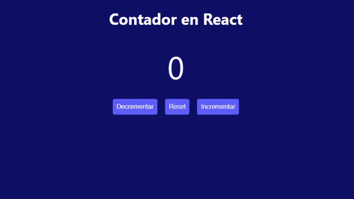

# Ejercicio 1 Contador

This project was bootstrapped with [Create React App](https://github.com/facebook/create-react-app).

El objetivo de este ejercicio es crear un contador usando React:

## Available Scripts

In the project directory, you can run:

### `yarn start`

Runs the app in the development mode.\
Open [http://localhost:3000](http://localhost:3000) to view it in the browser.
